```mermaid
sequenceDiagram
participant Backend
participant Redis
participant PostgreSQL

    note over Backend, PostgreSQL: 🖱️ БЛОК 1: Обработка POST /taps

    Backend->>Backend: 1.1 🔍 Проверка роли пользователя\nisNikita = (user.role === 'nikita')

    note over Redis: 🔧 Lua Script: tap_delta.lua (EVALSHA)
    Backend->>Redis: 1.2 TapCacheService.addDelta()\nEVALSHA tap_delta.sha\nKEYS: [taps_key, points_key, leaderboard_key, active_rounds_key]\nARGS: [userId, isNikita, roundEndTime, roundId]

    note right of Redis: ⚡ Атомарные операции в tap_delta.lua:\n1. INCR round:123:user:456:taps → 11\n2. IF isNikita == '0': points = (tap % 11 == 0) ? 10 : 1\n3. INCRBY round:123:user:456:points +points\n4. ZADD round:123:leaderboard total_points user456\n5. ZADD active:rounds endTimestamp roundId\n6. EXPIRE keys (TTL = round_end + 30min)

    Redis-->>Backend: 1.3 {tapCount: 11, points: 16}

    note over Backend, PostgreSQL: 📊 БЛОК 2: Обработка GET /rounds/:id/stats

    Backend->>Backend: 2.1 🔍 Извлечение userId из JWT\ncurrentUserId = "user456"

    Backend->>Redis: 2.2 TapCacheService.getLeaderboard()\nЗREVRANGE round:123:leaderboard 0 -1 WITHSCORES
    Redis-->>Backend: 2.3 ['user1', '150', 'user2', '120',\n'user456', '16']

    Backend->>Backend: 2.4 📊 Парсим лидерборд в структуру\n[{userId: 'user1', points: 150, position: 1},\n{userId: 'user2', points: 120, position: 2},\n{userId: 'user456', points: 16, position: 3}]

    Backend->>PostgreSQL: 2.5 SELECT id, username FROM users\nWHERE id IN ('user1', 'user2', 'user456')
    PostgreSQL-->>Backend: 2.6 [{id: 'user1', username: 'Alice'},\n{id: 'user2', username: 'Bob'},\n{id: 'user456', username: 'John'}]

    Backend->>Backend: 2.7 📋 Объединяем данные\n[{userId: 'user1', username: 'Alice', points: 150, position: 1},\n{userId: 'user2', username: 'Bob', points: 120, position: 2},\n{userId: 'user456', username: 'John', points: 16, position: 3}]

    note over Backend, PostgreSQL: 🔄 БЛОК 3: FlushWorker - Конкурентная обработка через Sorted Set (каждые 30с)

    loop 3.1 Воркер берет батч (BATCH_SIZE = 5)
        Backend->>Redis: 3.2 getRoundFromQueue()\nZPOPMIN active:rounds (берем раунд с наименьшим endTime)
        Redis-->>Backend: 3.3 {roundId: '123', endTime: 1719876543000}
        
        Backend->>Backend: 3.4 🕐 Проверяем истечение\ncurrentTime > endTime?
        
        alt Раунд завершен
            Backend->>Redis: 3.5 cleanupExpiredRound('123')\nKEYS round:123:* + DEL + ZREM active:rounds '123'
            Redis-->>Backend: 3.6 ✅ Раунд полностью очищен
            
        else Раунд активен
            Backend->>Redis: 3.7 getRoundUsersCounters('123')\n1. ZREVRANGE round:123:leaderboard 0 -1 WITHSCORES\n2. MGET round:123:user:*:taps round:123:user:*:points
            Redis-->>Backend: 3.8 Map<userId, {tapCount, points}>
            
            loop 3.9 Для каждого пользователя из Map
                Backend->>PostgreSQL: 3.10 UPSERT playerRoundStats\nWHERE roundId_userId\nUPDATE taps, points\nCREATE if not exists
                PostgreSQL-->>Backend: 3.11 ✅ Синхронизировано
            end
        end
    end

    note over Backend: 📊 Результат батча обработки

    note over Backend, PostgreSQL: 🚀 Результат финальной архитектуры
    note right of PostgreSQL: ✅ Sorted Set для активных раундов (уникальность)\n⚡ ZPOPMIN атомарное распределение между воркерами\n📊 Приоритизация по времени завершения\n🔄 getRoundUsersCounters (1 ZREVRANGE + 1 MGET)\n🛡️ Нет дублирования раундов\n\n🎯 Ключевые оптимизации:\n- active:rounds (Sorted Set: roundId → endTime)\n- Lua скрипт добавляет раунды атомарно\n- Воркеры обрабатывают раунды без конфликтов\n- Батчевая синхронизация с PostgreSQL
```

## 🔧 Подробное объяснение Redis методов:

### 🎯 **EVALSHA tap_delta.lua** - Основной метод обработки тапов
**Параметры:**
- `KEYS[1]`: `round:{roundId}:user:{userId}:taps` - счетчик тапов
- `KEYS[2]`: `round:{roundId}:user:{userId}:points` - счетчик очков  
- `KEYS[3]`: `round:{roundId}:leaderboard` - лидерборд (sorted set)
- `ARGV[1]`: userId - идентификатор пользователя
- `ARGV[2]`: isNikita ('0' или '1') - флаг роли Nikita
- `ARGV[3]`: roundEndTimestamp - время окончания раунда (опционально)

**Логика скрипта:**
1. Атомарный инкремент счетчика тапов
2. Вычисление очков: каждый 11-й тап = 10 очков, остальные = 1 очко
3. Для Nikita: всегда 0 очков
4. Атомарный инкремент общего счетчика очков
5. Добавление в sorted set лидерборда с обновленным счетом
6. Установка времени жизни ключей для всех ключей

### 📊 **Получение лидерборда с сортировкой по убыванию**
**Команда:** `ZREVRANGE round:{roundId}:leaderboard 0 -1 WITHSCORES`
**Результат:** Массив [member1, score1, member2, score2, ...]

### 🔄 **Батчевое получение множественных ключей одним запросом**
**Команда:** `MGET key1 key2 key3 ...`
**Оптимизация:** Один запрос вместо множества GET

### 🔐 **Блокировки и TTL:**
- `SET lock_key "locked" PX ttl NX` - Атомарная блокировка
- Установка времени жизни ключей - Автоочистка данных после раунда

### 📈 **Legacy методы (для обратной совместимости):**
- `clicks:{roundId}:{userId}` - старая структура ключей
- `KEYS pattern` + `GET/DEL` - менее эффективные операции
