# TLoG Backend Architecture Diagrams

## 🏗️ System Architecture Overview

This document contains detailed sequence diagrams showing how the TLoG backend handles user interactions, Redis operations, and database synchronization through the FlushWorker.

```mermaid
sequenceDiagram
participant Backend
participant Redis
participant PostgreSQL

    note over Backend, PostgreSQL: 🖱️ BLOCK 1: POST /taps Processing

    Backend->>Backend: 1.1 🔍 Check user role\nisNikita = (user.role === 'nikita')

    note over Redis: 🔧 Lua Script: tap_delta.lua (EVALSHA)
    Backend->>Redis: 1.2 TapCacheService.addDelta()\nEVALSHA tap_delta.sha\nKEYS: [taps_key, points_key, leaderboard_key, active_rounds_key]\nARGS: [userId, isNikita, roundEndTime, roundId]

    note right of Redis: ⚡ Atomic operations in tap_delta.lua:\n1. INCR round:123:user:456:taps → 11\n2. IF isNikita == '0': points = (tap % 11 == 0) ? 10 : 1\n3. INCRBY round:123:user:456:points +points\n4. ZADD round:123:leaderboard total_points user456\n5. ZADD active:rounds endTimestamp roundId\n6. EXPIRE keys (TTL = round_end + 30min)

    Redis-->>Backend: 1.3 {tapCount: 11, points: 16}

    note over Backend, PostgreSQL: 📊 BLOCK 2: GET /rounds/:id/stats Processing

    Backend->>Backend: 2.1 🔍 Extract userId from JWT\ncurrentUserId = "user456"

    Backend->>Redis: 2.2 TapCacheService.getLeaderboard()\nZREVRANGE round:123:leaderboard 0 -1 WITHSCORES
    Redis-->>Backend: 2.3 ['user1', '150', 'user2', '120',\n'user456', '16']

    Backend->>Backend: 2.4 📊 Parse leaderboard structure\n[{userId: 'user1', points: 150, position: 1},\n{userId: 'user2', points: 120, position: 2},\n{userId: 'user456', points: 16, position: 3}]

    Backend->>PostgreSQL: 2.5 SELECT id, username FROM users\nWHERE id IN ('user1', 'user2', 'user456')
    PostgreSQL-->>Backend: 2.6 [{id: 'user1', username: 'Alice'},\n{id: 'user2', username: 'Bob'},\n{id: 'user456', username: 'John'}]

    Backend->>Backend: 2.7 📋 Merge data\n[{userId: 'user1', username: 'Alice', points: 150, position: 1},\n{userId: 'user2', username: 'Bob', points: 120, position: 2},\n{userId: 'user456', username: 'John', points: 16, position: 3}]

    note over Backend, PostgreSQL: 🔄 BLOCK 3: FlushWorker - Redis → PostgreSQL Sync (@Cron every 30s)

    loop FlushWorker.processActiveRounds() - Batch Processing (BATCH_SIZE = 5)
        Backend->>Redis: 3.1 ZPOPMIN active:rounds\n(atomically get round with lowest endTime)
        Redis-->>Backend: 3.2 {roundId: '123', endTime: 1719876543000}
        
        note over Backend: 3.3 🔄 processRoundWithRetry(roundId, endTime)\nSYNC FIRST, then check expiration
        
        Backend->>Backend: 3.4 PlayerStatsService.syncRoundStats(roundId)\nwith retry logic (MAX_RETRY_ATTEMPTS = 3)
        
        Backend->>Redis: 3.5 ZREVRANGE round:123:leaderboard 0 -1 WITHSCORES\n(get all round users)
        Redis-->>Backend: 3.6 ['user1', '150', 'user2', '120', 'user456', '16']
        
        loop For each userId from leaderboard
            Backend->>Redis: 3.7 TapCacheService.getCounters(roundId, userId)\nMGET round:123:user:456:taps round:123:user:456:points
            Redis-->>Backend: 3.8 {tapCount: 11, points: 16}
            
            Backend->>PostgreSQL: 3.9 UPSERT playerRoundStats\nWHERE roundId_userId = {roundId: '123', userId: '456'}\nUPDATE taps = 11, points = 16\nCREATE if not exists
            PostgreSQL-->>Backend: 3.10 ✅ Synchronized
        end
        
        note over Backend: 3.11 ✅ Sync completed successfully
        
        Backend->>Backend: 3.12 🕐 isRoundExpired(roundId, endTime)\ncurrentTime > endTime?
        
        alt Round expired
            Backend->>Redis: 3.13 cleanupExpiredRound(roundId)\nDEL round:123:* + ZREM active:rounds roundId
            Redis-->>Backend: 3.14 ✅ Round completely cleaned from Redis
        else Round active
            note over Backend: 3.15 📝 Round remains in active:rounds\nfor next worker iteration
        end
        
        note over Backend: 3.16 🔁 Process next round from batch
    end
    
    note over Backend: 3.17 📊 Promise.allSettled for all batch rounds\nLogging: successful vs failed

    note over Backend, PostgreSQL: 🚀 Key FlushWorker Architecture Features
    note right of PostgreSQL: ✅ ZPOPMIN guarantees no race conditions\n⚡ Batch processing (5 rounds in parallel)\n🔄 Retry with exponential backoff on errors\n📊 Prioritization by round end time\n🛡️ Return round to queue on sync error\n\n🎯 Operation sequence:\n1. Synchronize data to PostgreSQL\n2. Check round expiration\n3. Cleanup Redis only after successful sync\n4. Log batch processing results
```

## 🔧 Detailed Redis Methods Explanation

### 🎯 **EVALSHA tap_delta.lua** - Main Tap Processing Method
**Parameters:**
- `KEYS[1]`: `round:{roundId}:user:{userId}:taps` - tap counter
- `KEYS[2]`: `round:{roundId}:user:{userId}:points` - points counter  
- `KEYS[3]`: `round:{roundId}:leaderboard` - leaderboard (sorted set)
- `KEYS[4]`: `active:rounds` - active rounds sorted set
- `ARGV[1]`: userId - user identifier
- `ARGV[2]`: isNikita ('0' or '1') - Nikita role flag
- `ARGV[3]`: roundEndTimestamp - round end time
- `ARGV[4]`: roundId - round identifier

**Script Logic:**
1. Atomic tap counter increment
2. Points calculation: every 11th tap = 10 points, others = 1 point
3. For Nikita: always 0 points
4. Atomic total points counter increment
5. Add to leaderboard sorted set with updated score
6. Add round to active queue for FlushWorker
7. Set TTL for all keys

### 📊 **Leaderboard Retrieval with Descending Sort**
**Command:** `ZREVRANGE round:{roundId}:leaderboard 0 -1 WITHSCORES`
**Result:** Array [member1, score1, member2, score2, ...]

### 🔄 **FlushWorker: Redis → PostgreSQL Synchronization**
**Period:** Every 30 seconds (@Cron)
**Strategy:** 
1. **ZPOPMIN active:rounds** - atomic round retrieval with lowest end time
2. **PlayerStatsService.syncRoundStats()** - sync all round users
3. **Retry with backoff** - up to 3 attempts with exponential delay
4. **Expiration check** - only after successful sync
5. **Cleanup** - remove from Redis only expired rounds

### 🔄 **Batch Key Retrieval in Single Request**
**Command:** `MGET key1 key2 key3 ...`
**Optimization:** One request instead of multiple GETs

### 🔐 **Locks and TTL:**
- `SET lock_key "locked" PX ttl NX` - Atomic locking
- TTL for keys - Auto-cleanup after round

### 📈 **Legacy Methods (for backward compatibility):**
- `clicks:{roundId}:{userId}` - old key structure
- `KEYS pattern` + `GET/DEL` - less efficient operations

## 🔧 FlushWorker Architecture

### 🎯 **Core Components:**
- **FlushWorker** (`src/workers/flush.worker.ts`) - Cron job every 30 seconds
- **PlayerStatsService** (`src/modules/rounds/player-stats.service.ts`) - Data synchronization
- **TapCacheService** (`src/cache/tap-cache.service.ts`) - Redis operations

### 🔄 **Processing Logic:**
1. **Batch processing** - up to 5 rounds in parallel
2. **Prioritization** - rounds with lowest end time first
3. **Fault tolerance** - retry with exponential backoff
4. **Consistency** - sync before cleanup
5. **Monitoring** - detailed result logging

### 🛡️ **Error Handling:**
- On sync error, round is returned to queue
- Maximum 3 attempts with increasing delay
- Promise.allSettled for independent round processing
- Detailed logging of successes and failures

## 🏗️ Architecture Benefits

### ⚡ **Performance Optimizations:**
- **Lua Scripts**: Atomic Redis operations reduce network roundtrips
- **Batch Processing**: Multiple rounds processed simultaneously
- **Sorted Sets**: Efficient priority-based round processing
- **Connection Pooling**: Optimized database connections

### 🛡️ **Reliability Features:**
- **Race Condition Prevention**: ZPOPMIN ensures atomic round distribution
- **Data Consistency**: Sync-first approach prevents data loss
- **Retry Logic**: Exponential backoff handles transient failures
- **Monitoring**: Comprehensive logging for troubleshooting

### 📈 **Scalability Design:**
- **Horizontal Scaling**: Multiple worker instances can process different rounds
- **Queue-based Processing**: Active rounds queue prevents duplicate processing
- **Stateless Workers**: No shared state between worker instances
- **Database Optimization**: Bulk operations and prepared statements
